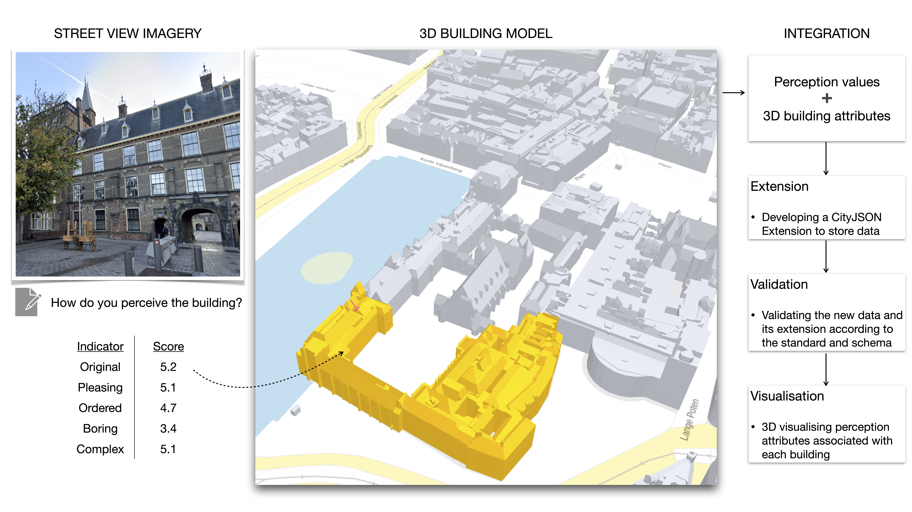

# Integrating human perception in 3D city models and urban digital twins

## Introduction

Urban digital twins, and 3D city models underpinning them, provide novel solutions to urban management but tend to overlook the human element. The trending research on human perception reveals people’s perspective towards interpreting and experiencing the built environment. 

Advancing the representation of building physics and descriptive information in 3D city models and urban digital twins, we establish the addition and integration of the notion of how humans perceive buildings. Unlocking a new dimension in our domain, this new concept can facilitate a broader adoption of semantic 3D data in socio-economic fields across various domains, and advance existing use cases in 3D GIS. 

This work is the first instance of integrating such attributes in 3D city models, which have traditionally been confined to physical and objective measures. The visual perception of each building is evaluated based on building images extracted from street view images. We add such information as new attributes to an existing CityJSON dataset representing thousands of 3D buildings in Amsterdam, the Netherlands. 

To facilitate a robust and sustainable integration, we develop a CityJSON Extension to accommodate the new data and validate its schema successfully, and we visualise the semantic 3D dataset. Further, we present two use cases to demonstrate the usability of our new data for downstream analysis. One is the concurrent clustering of buildings based on 3D morphology and human perception, while the other is conducting an attribute-based query that enables
various stakeholders to identify a particular building of

## Workflow

The workflow of integrating human perception of buildings in 3D city models and urban digital twins. Sources of data: Google Street View and 3D BAG.

